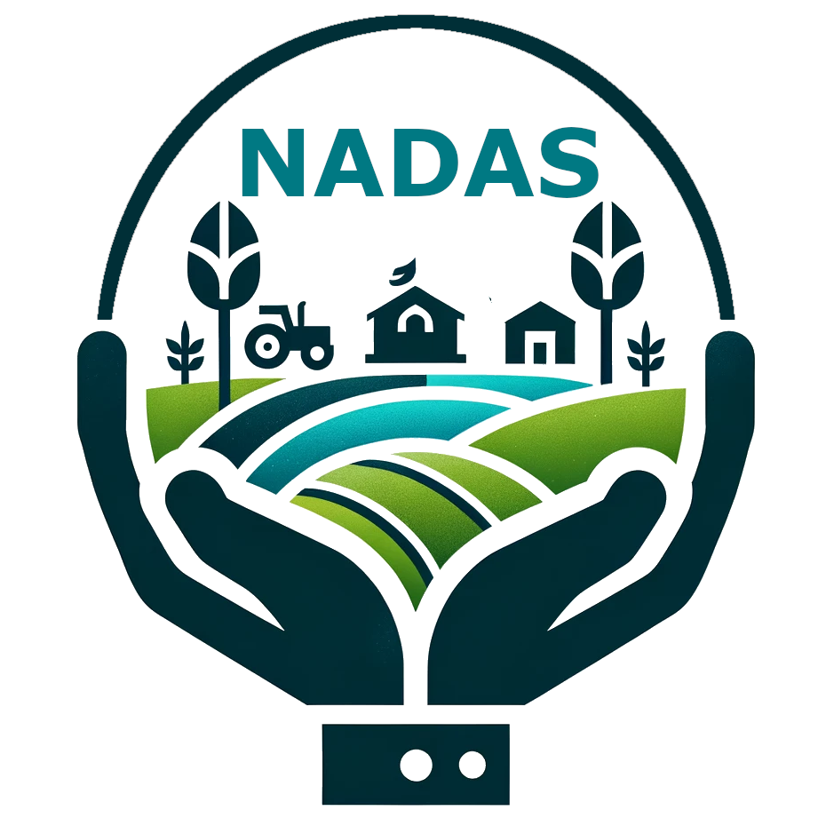

# NADAS-network

  

This is the repository for the Nordic Network of Agricultural Data Scientists. 

Our aim is to foster an exchange of ideas, discussions, tool development and data sharing between interested parties in the Nordic region. We also want to develop and provide training for everybody interested in agricultural data science.

Please check out [homepage](https://nadas-network.github.io/homepage/) for news and contact information. 

We are looking forward to hearing from you!
